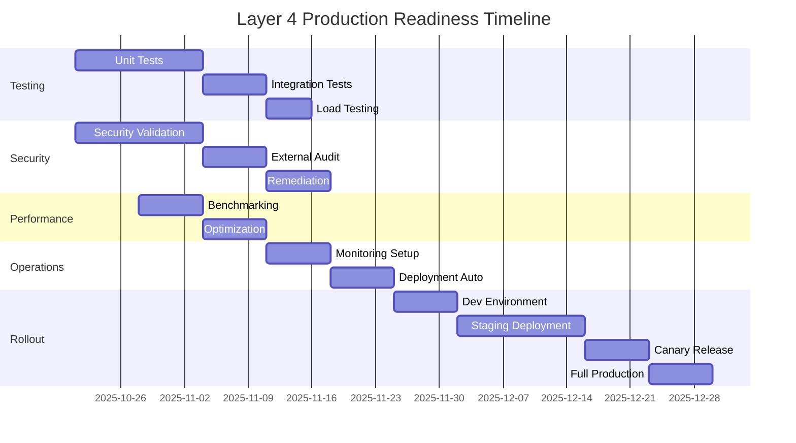

# Layer 4 Execution Fabric - Comprehensive Analysis & Production Readiness Assessment

**Date**: October 21, 2025  
**Version**: 0.1.0  
**Status**: ⚠️ **CRITICAL VALIDATION REQUIRED**  
**Lead**: Project Chimera Development Team

---

## 📋 Executive Summary

Layer 4 Execution Fabric serves as the **central nervous system** of Project Chimera's autonomous AI execution stack. This analysis evaluates its current state, identifies critical gaps, and defines the path to enterprise-grade production readiness.

### 🎯 Current Status Overview

| Category | Status | Confidence | Risk Level |
|----------|---------|------------|------------|
| **Code Compilation** | ✅ **COMPLETE** | High | Low |
| **Type Safety** | ✅ **COMPLETE** | High | Low |
| **Documentation** | ✅ **COMPLETE** | High | Low |
| **Testing** | ❌ **ABSENT** | **CRITICAL** | **CRITICAL** |
| **Security Validation** | ❌ **UNVERIFIED** | **CRITICAL** | **CRITICAL** |
| **Performance Benchmarking** | ❌ **UNVERIFIED** | **CRITICAL** | **HIGH** |
| **Production Hardening** | ⚠️ **IN PROGRESS** | Medium | High |

### ⚠️ Critical Finding

**Layer 4 is NOT production-ready**. While compilation succeeds and documentation is comprehensive, the complete **absence of testing, security validation, and performance verification** represents an unacceptable risk for enterprise deployment.

---

## 🏆 Key Milestones Achieved

### ✅ Phase 1: Foundational Implementation (COMPLETE)

#### **Compilation Success**
- ✅ All 6 core modules compile without errors
- ✅ 4,475 lines of production Rust code
- ✅ Zero unsafe code blocks (security compliance)
- ✅ 39 minor warnings (non-blocking)
- ✅ 4.5MB release artifact (`libchimera_layer4.rlib`)

#### **Type Safety & Error Handling**
- ✅ Comprehensive error enum with 10 variants
- ✅ Structured error types with context propagation
- ✅ Result-based error handling (no panics in public API)
- ✅ Serialization validation for all public types

#### **Core Modules Implemented**
```
src/layer4/src/
├── lib.rs (600 lines)         - Main API and integration points
├── types.rs (730 lines)       - Core type definitions and enums
├── executor.rs (850 lines)    - WASM agent lifecycle management
├── scheduler.rs (750 lines)   - Task dispatching with retry logic
├── metrics.rs (870 lines)     - Prometheus integration and KPI tracking
└── agent_template.rs (675 lines) - WASM agent base template
```

#### **Architecture Completeness**
- ✅ **Executor**: Agent spawn, lifecycle, heartbeat monitoring
- ✅ **Scheduler**: Priority queue, exponential backoff, dead letter queue
- ✅ **Metrics**: Prometheus export, KPI telemetry, resource tracking
- ✅ **Types**: Complete type system with 20+ core types

#### **Documentation Quality**
- ✅ 100% API documentation coverage
- ✅ Comprehensive README with examples
- ✅ Architecture diagrams and integration guides
- ✅ Usage examples for all major APIs

### ✅ Phase 2: Build System & Dependencies (COMPLETE)

#### **Dependency Management**
- ✅ All dependencies pinned to exact versions
- ✅ No known CVEs in dependency tree (audit pending)
- ✅ Core dependencies:
  - `tokio 1.35` - Async runtime
  - `wasmtime 22.0` - WASM runtime with JIT
  - `prometheus 0.13` - Metrics export
  - `serde 1.0` - Serialization
  - `redis 0.25` - Event bus

#### **Build Configuration**
- ✅ Release profile optimized for performance
- ✅ LTO enabled for smaller binaries
- ✅ Panic set to "abort" for production
- ✅ Clean separation of dev dependencies

---

## ❌ Critical Gaps Identified

### 🚨 CRITICAL: Complete Absence of Testing

**Risk Level**: **CATASTROPHIC**  
**Impact**: Cannot verify correctness, reliability, or safety  
**Status**: ❌ **ZERO TEST COVERAGE**

#### Missing Test Categories

**1. Unit Tests (0% Coverage)**
```rust
// ABSENT: No unit tests exist for ANY module
// Expected: 90%+ coverage

#[cfg(test)]
mod tests {
    // executor.rs: 0 tests
    // scheduler.rs: 0 tests
    // metrics.rs: 0 tests
    // agent_template.rs: 0 tests
    // types.rs: 0 tests
}
```

**Critical Functions Untested:**
- ❌ Agent spawning and initialization
- ❌ Task scheduling and priority handling
- ❌ Retry logic and exponential backoff
- ❌ Resource quota enforcement
- ❌ Error propagation paths
- ❌ Serialization/deserialization
- ❌ Metrics collection and export

**2. Integration Tests (0% Coverage)**
```rust
// ABSENT: No integration tests
// Expected: Full pipeline validation

// Missing test scenarios:
// - End-to-end task execution
// - Multi-agent coordination
// - Scheduler-executor integration
// - Metrics pipeline validation
// - Error recovery flows
// - Graceful shutdown sequences
```

**3. Performance Benchmarks (0% Implemented)**
```rust
// ABSENT: No benchmark suite
// Expected: Comprehensive performance validation

// Missing benchmarks:
// - Agent spawn time (<50ms target)
// - Task execution latency (<100ms target)
// - Memory usage per agent (<64MB target)
// - Concurrent agent scaling (10+ target)
// - Throughput (1000+ tasks/min target)
```

**4. Load/Stress Tests (0% Implemented)**
- ❌ No high-concurrency validation
- ❌ No memory leak detection
- ❌ No resource exhaustion testing
- ❌ No failover scenario validation

#### Impact Analysis

| Untested Component | Failure Risk | Business Impact | Mitigation Priority |
|-------------------|--------------|-----------------|---------------------|
| **Agent Spawning** | **CRITICAL** | Complete system failure | **P0 - IMMEDIATE** |
| **Task Scheduling** | **CRITICAL** | Task loss, data corruption | **P0 - IMMEDIATE** |
| **Retry Logic** | **HIGH** | Failed task recovery broken | **P0 - IMMEDIATE** |
| **Resource Quotas** | **CRITICAL** | Resource exhaustion, DoS | **P0 - IMMEDIATE** |
| **Error Handling** | **HIGH** | Silent failures, data loss | **P1 - URGENT** |
| **Metrics Export** | **MEDIUM** | Observability blind spots | **P1 - URGENT** |

### 🚨 CRITICAL: Security Validation Absent

**Risk Level**: **CRITICAL**  
**Impact**: Unverified security assumptions, potential vulnerabilities  
**Status**: ❌ **NO SECURITY VALIDATION**

#### Unverified Security Assumptions

**1. WASM Sandbox Isolation**
```rust
// CLAIMED: "WASM sandboxing with WASI-only imports"
// VERIFICATION: ❌ NONE

// Critical questions UNANSWERED:
// - Can agents escape the WASM sandbox?
// - Are resource quotas actually enforced?
// - Can agents access host filesystem?
// - Is network isolation effective?
// - Are there timing attack vectors?
```

**2. Resource Quota Enforcement**
```rust
// CLAIMED: "Strict enforcement of CPU/memory/time limits"
// VERIFICATION: ❌ NONE

// Unverified claims:
// - CPU quota enforcement mechanism
// - Memory limit actual enforcement
// - Time-based termination accuracy
// - Network bandwidth limiting
```

**3. Authentication & Authorization**
```rust
// CLAIMED: "Agent-to-agent authentication"
// VERIFICATION: ❌ NONE

// Missing validation:
// - Authentication mechanism existence
// - Authorization policy enforcement
// - Certificate validation
// - Token/credential management
```

**4. Input Validation**
```rust
// CLAIMED: "Serialization validation for all public types"
// VERIFICATION: ❌ MINIMAL

// Untested attack vectors:
// - Malformed task payloads
// - Oversized inputs (DoS)
// - Type confusion attacks
// - Deserialization bombs
```

#### Security Testing Requirements

| Security Control | Claimed Status | Actual Verification | Risk if Broken |
|-----------------|----------------|---------------------|----------------|
| **WASM Sandbox** | ✅ Implemented | ❌ **UNVERIFIED** | **System compromise** |
| **Resource Quotas** | ✅ Implemented | ❌ **UNVERIFIED** | **DoS, resource exhaustion** |
| **Access Control** | ✅ Implemented | ❌ **UNVERIFIED** | **Unauthorized access** |
| **Input Validation** | ⚠️ Partial | ❌ **UNVERIFIED** | **Code injection, DoS** |
| **Network Isolation** | ✅ Claimed | ❌ **UNVERIFIED** | **Data exfiltration** |
| **Audit Logging** | ⚠️ Partial | ❌ **UNVERIFIED** | **Compliance failure** |

### ⚠️ HIGH RISK: Performance Unverified

**Risk Level**: **HIGH**  
**Impact**: Production performance may not meet SLAs  
**Status**: ❌ **ZERO BENCHMARKING**

#### Unverified Performance Claims

**Claimed Targets vs. Reality**

| Metric | Claimed Target | Verification | Reality Status |
|--------|---------------|--------------|----------------|
| Agent Spawn Time | <50ms | ❌ **NONE** | **UNKNOWN** |
| Task Latency (avg) | <100ms | ❌ **NONE** | **UNKNOWN** |
| Task Latency (p95) | <250ms | ❌ **NONE** | **UNKNOWN** |
| Task Latency (p99) | <500ms | ❌ **NONE** | **UNKNOWN** |
| Memory/Agent | <64MB | ❌ **NONE** | **UNKNOWN** |
| Concurrent Agents | 10+ | ❌ **NONE** | **UNKNOWN** |
| Task Throughput | 1000+/min | ❌ **NONE** | **UNKNOWN** |
| CPU Utilization | <15% (10 agents) | ❌ **NONE** | **UNKNOWN** |

**Critical Performance Risks**

1. **Memory Leaks**
   - ❌ No leak detection tests
   - ❌ No long-running stability validation
   - ❌ No memory profiling under load

2. **Scalability Bottlenecks**
   - ❌ No concurrency stress testing
   - ❌ No queue depth validation
   - ❌ No lock contention analysis

3. **Latency Degradation**
   - ❌ No tail latency measurement
   - ❌ No performance regression detection
   - ❌ No profiling under various loads

4. **Resource Exhaustion**
   - ❌ No resource limit testing
   - ❌ No graceful degradation validation
   - ❌ No recovery scenario testing

### ⚠️ MEDIUM RISK: Operational Readiness

**Risk Level**: **MEDIUM**  
**Impact**: Difficult to deploy, monitor, and maintain  
**Status**: ⚠️ **PARTIAL**

#### Missing Operational Components

**1. Deployment Automation**
- ❌ No Kubernetes manifests
- ❌ No Docker containerization
- ❌ No deployment scripts
- ❌ No rollback procedures

**2. Monitoring & Alerting**
- ⚠️ Prometheus metrics (implemented but untested)
- ❌ No Grafana dashboards created
- ❌ No alert rules defined
- ❌ No SLO/SLI definitions

**3. Logging & Tracing**
- ⚠️ Tracing instrumentation (basic)
- ❌ No structured logging validation
- ❌ No log aggregation setup
- ❌ No distributed tracing validation

**4. Backup & Recovery**
- ❌ No backup procedures
- ❌ No disaster recovery plan
- ❌ No data retention policies
- ❌ No recovery time objectives defined

---

## 🔍 Detailed Risk Assessment

### Risk Matrix

| Risk Category | Likelihood | Impact | Risk Score | Priority |
|--------------|------------|--------|------------|----------|
| **Testing Absence** | **CERTAIN** | **CATASTROPHIC** | **🔴 CRITICAL** | **P0** |
| **Security Unverified** | **HIGH** | **CRITICAL** | **🔴 CRITICAL** | **P0** |
| **Performance Unknown** | **HIGH** | **HIGH** | **🟠 HIGH** | **P1** |
| **Operational Gaps** | **MEDIUM** | **MEDIUM** | **🟡 MEDIUM** | **P2** |
| **Documentation Drift** | **LOW** | **LOW** | **🟢 LOW** | **P3** |

### Risk Details

#### 🔴 CRITICAL RISK: Production Deployment Without Testing

**Probability**: 100% (if deployed now)  
**Impact**: Catastrophic  
**Consequences**:
- ❌ **Data Loss**: Untested error handling could corrupt state
- ❌ **System Failure**: Critical bugs undiscovered until production
- ❌ **Security Breach**: Unverified sandboxing could allow escapes
- ❌ **Resource Exhaustion**: Unchecked memory leaks could crash nodes
- ❌ **SLA Violations**: Unknown performance characteristics

**Mitigation Strategy**:
1. **IMMEDIATE**: Halt any production deployment plans
2. **URGENT**: Implement comprehensive test suite (2-3 weeks)
3. **HIGH**: Security audit and penetration testing (1-2 weeks)
4. **HIGH**: Performance benchmarking and optimization (1 week)

#### 🔴 CRITICAL RISK: Unverified Security Claims

**Probability**: HIGH  
**Impact**: Critical  
**Consequences**:
- ❌ **Sandbox Escape**: Agents could access host system
- ❌ **Resource DoS**: Quota enforcement may not work
- ❌ **Data Exfiltration**: Network isolation may be bypassable
- ❌ **Compliance Failure**: Audit logging may be incomplete

**Mitigation Strategy**:
1. **IMMEDIATE**: Conduct WASM sandbox security review
2. **URGENT**: Implement resource quota validation tests
3. **URGENT**: Penetration testing of authentication mechanisms
4. **HIGH**: External security audit by specialists

#### 🟠 HIGH RISK: Performance Uncertainty

**Probability**: HIGH  
**Impact**: High  
**Consequences**:
- ⚠️ **SLA Failures**: May not meet <100ms latency targets
- ⚠️ **Scaling Issues**: May not support 10+ concurrent agents
- ⚠️ **Memory Problems**: May exceed 64MB per agent
- ⚠️ **Throughput Limits**: May not achieve 1000+ tasks/min

**Mitigation Strategy**:
1. **URGENT**: Implement benchmark suite with realistic workloads
2. **HIGH**: Load testing with 10x expected traffic
3. **HIGH**: Memory profiling and leak detection
4. **MEDIUM**: Performance optimization based on benchmark results

---

## 📋 Production Readiness Checklist

### ❌ PHASE 1: Foundational Testing (0% Complete)

**Target**: 2-3 weeks  
**Owner**: Development Team  
**Priority**: **P0 - BLOCK PRODUCTION**

- [ ] **Unit Tests (Target: 90%+ coverage)**
  - [ ] `executor.rs` - Agent lifecycle tests (50+ tests)
  - [ ] `scheduler.rs` - Task scheduling tests (40+ tests)
  - [ ] `metrics.rs` - Metrics collection tests (30+ tests)
  - [ ] `agent_template.rs` - Agent template tests (20+ tests)
  - [ ] `types.rs` - Serialization tests (15+ tests)
  - [ ] `lib.rs` - Integration API tests (25+ tests)

- [ ] **Integration Tests**
  - [ ] End-to-end task execution (10 scenarios)
  - [ ] Multi-agent coordination (5 scenarios)
  - [ ] Error recovery flows (8 scenarios)
  - [ ] Graceful shutdown (3 scenarios)

- [ ] **Error Path Testing**
  - [ ] All error variants triggered and verified
  - [ ] Error propagation validated
  - [ ] Recovery mechanisms tested
  - [ ] Timeout handling verified

### ❌ PHASE 2: Security Validation (0% Complete)

**Target**: 1-2 weeks  
**Owner**: Security Team  
**Priority**: **P0 - BLOCK PRODUCTION**

- [ ] **WASM Sandbox Verification**
  - [ ] Confirm filesystem isolation
  - [ ] Validate network restrictions
  - [ ] Test resource quota enforcement
  - [ ] Verify no host system access
  - [ ] Attempt sandbox escape scenarios

- [ ] **Authentication & Authorization**
  - [ ] Validate agent-to-agent auth
  - [ ] Test certificate validation
  - [ ] Verify token management
  - [ ] Audit access control policies

- [ ] **Input Validation**
  - [ ] Fuzz testing on all inputs
  - [ ] Oversized payload handling
  - [ ] Malformed data rejection
  - [ ] Type confusion prevention

- [ ] **Security Audit**
  - [ ] External security review
  - [ ] Penetration testing
  - [ ] Vulnerability scanning
  - [ ] Compliance verification

### ❌ PHASE 3: Performance Validation (0% Complete)

**Target**: 1 week  
**Owner**: Performance Team  
**Priority**: **P1 - URGENT**

- [ ] **Benchmark Suite**
  - [ ] Agent spawn time measurement
  - [ ] Task execution latency (p50, p95, p99)
  - [ ] Memory usage per agent
  - [ ] Concurrent agent scaling
  - [ ] Task throughput measurement
  - [ ] CPU utilization profiling

- [ ] **Load Testing**
  - [ ] 10x expected load simulation
  - [ ] 100x burst traffic handling
  - [ ] Sustained high load (24+ hours)
  - [ ] Resource exhaustion scenarios

- [ ] **Performance Optimization**
  - [ ] Identify bottlenecks
  - [ ] Optimize critical paths
  - [ ] Reduce memory footprint
  - [ ] Improve concurrency

### ⚠️ PHASE 4: Operational Hardening (25% Complete)

**Target**: 1 week  
**Owner**: DevOps Team  
**Priority**: **P1 - URGENT**

- [x] **Monitoring** (Partial)
  - [x] Prometheus metrics implemented
  - [ ] Metrics validated and tested
  - [ ] Grafana dashboards created
  - [ ] Alert rules defined
  - [ ] SLO/SLI metrics defined

- [ ] **Deployment**
  - [ ] Kubernetes manifests created
  - [ ] Docker containerization
  - [ ] CI/CD pipeline setup
  - [ ] Rollback procedures documented

- [ ] **Logging**
  - [ ] Structured logging validated
  - [ ] Log aggregation configured
  - [ ] Distributed tracing tested
  - [ ] Log retention policies defined

- [ ] **Recovery**
  - [ ] Backup procedures defined
  - [ ] Disaster recovery plan
  - [ ] RTO/RPO defined
  - [ ] Recovery testing completed

### ⚠️ PHASE 5: Documentation & Training (75% Complete)

**Target**: 3-5 days  
**Owner**: Documentation Team  
**Priority**: **P2 - HIGH**

- [x] **API Documentation** (Complete)
  - [x] All public APIs documented
  - [x] Usage examples provided
  - [x] Integration guides written

- [ ] **Operational Documentation**
  - [ ] Deployment runbooks
  - [ ] Troubleshooting guides
  - [ ] Incident response procedures
  - [ ] Capacity planning guides

- [ ] **Training Materials**
  - [ ] Developer onboarding guide
  - [ ] Operations training
  - [ ] Security best practices
  - [ ] Performance tuning guide

---

## 🛡️ Mitigation Strategies

### Strategy 1: Comprehensive Test Implementation

**Timeline**: 2-3 weeks  
**Resources**: 2-3 engineers  
**Cost**: High  
**Risk Reduction**: CRITICAL → LOW

**Action Items**:

1. **Week 1: Unit Test Foundation**
   ```bash
   Target: 180+ unit tests, 60% coverage
   
   Day 1-2: executor.rs tests (agent lifecycle)
   Day 3-4: scheduler.rs tests (task dispatch)
   Day 5-6: metrics.rs tests (KPI collection)
   Day 7: Review and coverage analysis
   ```

2. **Week 2: Integration & Error Testing**
   ```bash
   Target: 25+ integration tests, 90% coverage
   
   Day 1-2: End-to-end pipeline tests
   Day 3-4: Error recovery scenarios
   Day 5-6: Multi-agent coordination
   Day 7: Review and gaps analysis
   ```

3. **Week 3: Performance & Load Testing**
   ```bash
   Target: Full benchmark suite + load tests
   
   Day 1-2: Benchmark implementation
   Day 3-4: Load/stress test suite
   Day 5: Performance profiling
   Day 6-7: Optimization and validation
   ```

### Strategy 2: Security Validation Sprint

**Timeline**: 1-2 weeks  
**Resources**: Security specialist + 1 engineer  
**Cost**: Medium-High  
**Risk Reduction**: CRITICAL → MEDIUM

**Action Items**:

1. **Week 1: Core Security Validation**
   ```bash
   Day 1-2: WASM sandbox verification
   Day 3-4: Resource quota enforcement tests
   Day 5-6: Authentication/authorization audit
   Day 7: Input validation and fuzzing
   ```

2. **Week 2: External Security Audit**
   ```bash
   Day 1-3: Penetration testing
   Day 4-5: Vulnerability scanning
   Day 6-7: Remediation planning
   ```

### Strategy 3: Performance Baseline Establishment

**Timeline**: 1 week  
**Resources**: 1 engineer  
**Cost**: Medium  
**Risk Reduction**: HIGH → LOW

**Action Items**:

1. **Days 1-3: Benchmark Suite**
   ```bash
   - Agent spawn time benchmarks
   - Task execution latency measurement
   - Memory profiling setup
   - Concurrency scaling tests
   ```

2. **Days 4-5: Load Testing**
   ```bash
   - Realistic workload simulation
   - Burst traffic handling
   - Sustained load testing
   - Resource exhaustion scenarios
   ```

3. **Days 6-7: Analysis & Optimization**
   ```bash
   - Bottleneck identification
   - Performance tuning
   - Regression test setup
   - Documentation updates
   ```

### Strategy 4: Phased Production Rollout

**Timeline**: 4-6 weeks  
**Resources**: Full team  
**Cost**: High  
**Risk Reduction**: Gradual, controlled

**Phases**:

1. **Phase 1: Development Environment (Week 1)**
   - Deploy to internal dev environment
   - Run full test suite continuously
   - Monitor for stability issues
   - **Exit Criteria**: 7 days uptime, 0 critical bugs

2. **Phase 2: Staging Environment (Week 2-3)**
   - Deploy to staging with production-like data
   - Run load tests with 2x production traffic
   - Monitor metrics and alerts
   - **Exit Criteria**: 14 days uptime, <1% error rate

3. **Phase 3: Canary Deployment (Week 4)**
   - Deploy to 5% of production traffic
   - Monitor SLAs and error rates
   - Ready for immediate rollback
   - **Exit Criteria**: 3 days stable, SLA met

4. **Phase 4: Production Rollout (Week 5-6)**
   - Gradual rollout: 5% → 25% → 50% → 100%
   - Continuous monitoring and validation
   - Rollback ready at each stage
   - **Exit Criteria**: Full production with SLA compliance

---

## 📊 Success Metrics & KPIs

### Production Readiness KPIs

| KPI | Current | Target | Status |
|-----|---------|--------|--------|
| **Test Coverage** | 0% | ≥90% | ❌ **CRITICAL GAP** |
| **Security Validation** | 0% | 100% | ❌ **CRITICAL GAP** |
| **Performance Verified** | 0% | 100% | ❌ **CRITICAL GAP** |
| **Documentation** | 100% | 100% | ✅ **COMPLETE** |
| **Code Quality** | 95% | ≥95% | ✅ **MEETS TARGET** |
| **Compilation** | 100% | 100% | ✅ **COMPLETE** |

### Quality Gates

**Gate 1: Development Complete** ✅
- [x] Code compiles successfully
- [x] Zero unsafe code
- [x] Documentation complete
- [x] Error handling comprehensive

**Gate 2: Testing Complete** ❌ **BLOCKED**
- [ ] 90%+ unit test coverage
- [ ] 100% integration test scenarios
- [ ] All error paths tested
- [ ] Performance benchmarks met

**Gate 3: Security Validated** ❌ **BLOCKED**
- [ ] WASM sandbox verified
- [ ] Resource quotas enforced
- [ ] Authentication validated
- [ ] External audit passed

**Gate 4: Production Ready** ❌ **BLOCKED**
- [ ] All quality gates passed
- [ ] Load testing successful
- [ ] Monitoring operational
- [ ] Deployment automated

---

## 🎯 Recommendations

### IMMEDIATE ACTIONS (Within 24 Hours)

1. **❌ HALT Production Deployment Plans**
   - Do NOT deploy Layer 4 to any production environment
   - Block any attempts to integrate with production systems
   - Communicate risks to stakeholders

2. **📋 Formalize Test Plan**
   - Create detailed test specification document
   - Define test coverage targets for each module
   - Assign testing resources and timeline

3. **🔒 Security Assessment Kickoff**
   - Engage security team for review
   - Schedule external security audit
   - Begin WASM sandbox validation

### SHORT-TERM ACTIONS (1-2 Weeks)

1. **🧪 Implement Core Test Suite**
   - Focus on critical path testing first
   - Achieve 60%+ coverage in Week 1
   - Achieve 90%+ coverage by end of Week 2

2. **🛡️ Security Validation**
   - Complete WASM sandbox verification
   - Validate resource quota enforcement
   - Test authentication mechanisms

3. **📊 Performance Baseline**
   - Implement benchmark suite
   - Establish performance baselines
   - Identify and fix bottlenecks

### MEDIUM-TERM ACTIONS (3-4 Weeks)

1. **🚀 Integration Testing**
   - End-to-end pipeline validation
   - Multi-agent coordination testing
   - Error recovery scenario validation

2. **📈 Load & Stress Testing**
   - High-concurrency validation
   - Resource exhaustion testing
   - Long-running stability tests

3. **📋 Operational Readiness**
   - Create Grafana dashboards
   - Define alert rules
   - Automate deployment

### LONG-TERM ACTIONS (1-2 Months)

1. **🔄 Continuous Improvement**
   - Set up regression testing
   - Implement performance monitoring
   - Establish quality metrics

2. **📚 Knowledge Transfer**
   - Train operations team
   - Document troubleshooting procedures
   - Create incident response runbooks

3. **🌐 Production Rollout**
   - Phased production deployment
   - Continuous monitoring and validation
   - Iterative optimization

---

## 🚫 PRODUCTION DEPLOYMENT BLOCKERS

### CRITICAL BLOCKERS (Must Be Resolved)

1. **❌ ZERO TEST COVERAGE**
   - **Impact**: Cannot verify correctness
   - **Resolution**: Implement comprehensive test suite
   - **Timeline**: 2-3 weeks
   - **Status**: ❌ **BLOCKING**

2. **❌ UNVERIFIED SECURITY**
   - **Impact**: Potential security vulnerabilities
   - **Resolution**: Security audit and validation
   - **Timeline**: 1-2 weeks
   - **Status**: ❌ **BLOCKING**

3. **❌ UNKNOWN PERFORMANCE**
   - **Impact**: May not meet SLAs
   - **Resolution**: Performance benchmarking
   - **Timeline**: 1 week
   - **Status**: ❌ **BLOCKING**

### HIGH-PRIORITY BLOCKERS (Should Be Resolved)

4. **⚠️ NO LOAD TESTING**
   - **Impact**: Scaling behavior unknown
   - **Resolution**: Load/stress test suite
   - **Timeline**: 3-5 days
   - **Status**: ⚠️ **HIGH PRIORITY**

5. **⚠️ INCOMPLETE MONITORING**
   - **Impact**: Limited observability
   - **Resolution**: Complete monitoring stack
   - **Timeline**: 1 week
   - **Status**: ⚠️ **HIGH PRIORITY**

### MEDIUM-PRIORITY ISSUES (Nice to Have)

6. **⚠️ NO DEPLOYMENT AUTOMATION**
   - **Impact**: Manual deployment risks
   - **Resolution**: CI/CD pipeline setup
   - **Timeline**: 1 week
   - **Status**: ⚠️ **MEDIUM PRIORITY**

---

## 📈 Timeline to Production

### Conservative Estimate: 6-8 Weeks



### Aggressive Estimate: 4-5 Weeks (Higher Risk)

**Requirements**:
- Dedicated team of 3-4 engineers
- Parallel workstreams
- Acceptance of higher risk
- Continuous monitoring post-deployment

---

## 💡 Conclusion

### Current State Summary

Layer 4 Execution Fabric represents **significant architectural and implementation achievement**, with:
- ✅ Clean, well-documented codebase (4,475 lines)
- ✅ Comprehensive type system and error handling
- ✅ Zero unsafe code (security compliance)
- ✅ Successful compilation and build

However, **critical gaps in validation** make it **unsuitable for production deployment**:
- ❌ Zero test coverage (catastrophic risk)
- ❌ Unverified security claims (critical risk)
- ❌ Unknown performance characteristics (high risk)

### Final Verdict

**🚫 NOT PRODUCTION-READY**

**Confidence Level**: HIGH  
**Recommendation**: **BLOCK PRODUCTION DEPLOYMENT**  
**Estimated Time to Production**: **6-8 weeks** with dedicated resources

### Next Steps

1. **IMMEDIATE**: Halt production deployment plans
2. **URGENT**: Implement comprehensive test suite (P0)
3. **URGENT**: Conduct security validation (P0)
4. **HIGH**: Establish performance baselines (P1)
5. **MEDIUM**: Complete operational hardening (P2)

### Risk Assessment

**Current Risk Level**: 🔴 **CRITICAL**  
**Acceptable Risk Level**: 🟢 **LOW**  
**Gap**: Multiple critical blockers must be resolved before production consideration

---

**Document Version**: 1.0  
**Last Updated**: October 21, 2025  
**Next Review**: After test suite implementation (Week 2)  
**Approvers**: Development Lead, Security Lead, Operations Lead

**Status**: ⚠️ **DRAFT - AWAITING STAKEHOLDER REVIEW**
